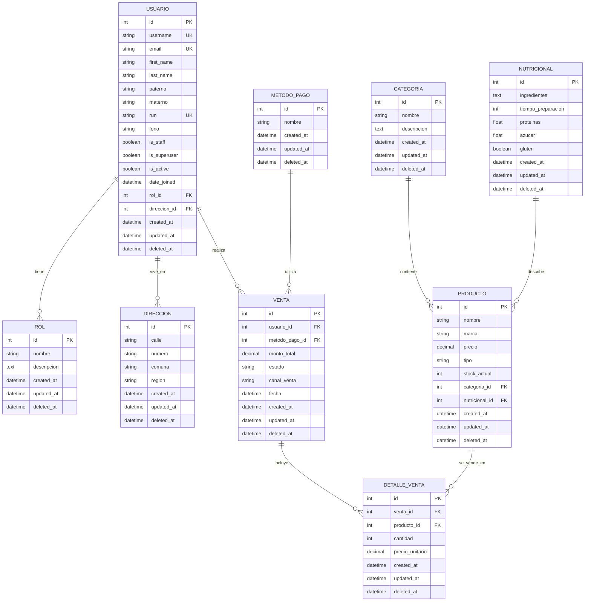

# Diagrama Entidad-Relación - La Fornería

## Base de Datos: la_forneria_db

## Descripción de las Entidades

### Tablas Maestras (4):
1. **ROL**: Define los roles del sistema (Admin, Cliente)
2. **DIRECCION**: Información de direcciones de usuarios
3. **CATEGORIA**: Categorías de productos (Panadería, Pastelería, Bebidas)
4. **NUTRICIONAL**: Información nutricional de productos

### Tablas Operativas (2):
1. **VENTA**: Registro de ventas realizadas
2. **DETALLE_VENTA**: Detalle de productos en cada venta

### Tabla Principal:
- **USUARIO**: Usuarios del sistema (extiende AbstractUser)
- **PRODUCTO**: Productos de la fornería
- **METODO_PAGO**: Métodos de pago disponibles

## Campos de Auditoría
Todas las tablas incluyen:
- `created_at`: Fecha de creación
- `updated_at`: Fecha de última modificación  
- `deleted_at`: Fecha de eliminación lógica (soft delete)

## Tipos de Datos Utilizados
- `int`: Enteros para IDs y cantidades
- `string`: Cadenas de texto cortas
- `text`: Cadenas de texto largas
- `decimal`: Números decimales para precios
- `boolean`: Valores verdadero/falso
- `datetime`: Fechas y horas
